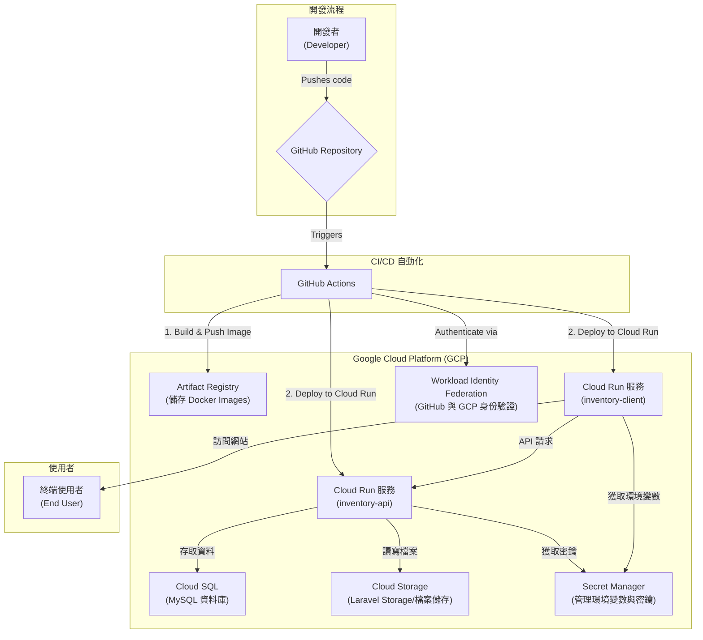
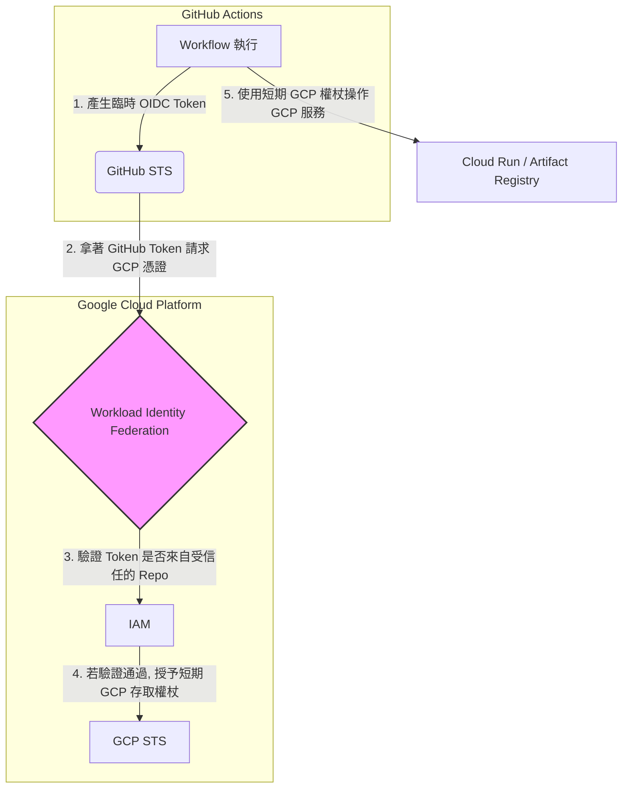

# 專案部署至 Google Cloud 之完整規劃 (v2.0 - 流程重構版)

本文檔旨在為 `inventory-api` (Laravel) 和 `inventory-client` (Next.js) 專案提供一個完整、清晰、按時間順序執行的 Google Cloud Platform (GCP) 部署方案。

**專案配置參數:**
- **GCP 專案 ID:** `turnkey-pottery-461707-b5`
- **GCP 部署區域:** `asia-east1`
- **Cloud SQL 實例名稱:** `lomis-db-instance`
- **Cloud SQL 資料庫名稱:** `lomis_internal`
- **Cloud SQL 資料庫使用者:** `h1431532403240`
- **Cloud Storage Bucket 名稱:** `lomis_internal_inventory_assets`

---

## 部署流程概覽 (四階段法)

我們將嚴格按照以下四個階段順序執行，確保每一步都有明確的前提和結果。

1.  **[第一階段：基礎設施建立]** - **一次性作業**。使用 `gcloud` 指令碼建立所有雲端資源。
2.  **[第二階段：首次部署與驗證]** - 執行 CI/CD 流程，讓應用程式使用 GCP 自動產生的臨時網址 (`.run.app`) 先運行起來。
3.  **[第三階段：綁定自訂網域]** - 將您的自訂網域 (如 `api.your-domain.com`) 指向已部署的 Cloud Run 服務。
4.  **[第四階段：CI/CD 最終化]** - 修改 GitHub Actions 工作流程，使其永久使用您的自訂網域進行後續部署。

---

## 第一階段：基礎設施建立 (一次性作業)

**目標：** 建立所有需要的 GCP 雲端資源。

**操作：**
1.  請先安裝並設定好 `gcloud` CLI 工具。
2.  打開 **[附錄 B](#10-附錄-b使用-gcloud-指令集建立基礎設施)** 中的指令碼。
3.  **重要：** 將指令碼中的 `YOUR_GITHUB_ORG/YOUR_REPO_NAME` 變數替換為您自己的 GitHub 組織名與儲存庫名稱。
4.  逐一複製並執行指令碼中的所有指令。
5.  執行完畢後，指令碼會輸出您需要設定在 GitHub Secrets 中的所有值。請將這些值（`GCP_PROJECT_ID`, `GCP_WORKLOAD_IDENTITY_PROVIDER` 等）設定到您 GitHub Repo 的 `Settings > Secrets and variables > Actions` 中。

**完成標誌：** 所有 GCP 資源建立完畢，且 GitHub Secrets 已設定完成。

---

## 第二階段：首次部署與驗證

**目標：** 在不考慮自訂網域的情況下，先讓前後端應用程式成功部署並可以透過臨時網址互相通訊。

**操作：**
1.  確保您專案中已有 `.github/workflows/deploy.yml` 檔案 (內容見 **[附錄 C](#11-附錄-cgithub-actions-workflow-檔案)**)。此版本的 workflow 會自動偵測後端的 `.run.app` 網址並注入到前端。
2.  將您的程式碼推送到 `master` (或您的主要) 分支，觸發 GitHub Actions。
3.  等待 `deploy-api` 和 `deploy-client` 兩個任務都成功完成。
4.  部署成功後，前往 GCP Cloud Run Console，找到 `inventory-client` 服務，點擊其提供的 `...run.app` 網址。
5.  **驗證：** 測試網站功能，確保前端頁面可以正常發出 API 請求並從後端獲取資料。如果一切正常，代表您的應用程式本身和基礎設施（資料庫、儲存）都已配置無誤。

**完成標誌：** 您可以透過 `inventory-client` 的 `...run.app` 網址成功訪問並使用您的應用程式。

---

## 第三階段：綁定自訂網域

**目標：** 將您的自訂網域指向已經在運行的 Cloud Run 服務，並完成 DNS 設定。

**操作：**

#### 步驟 3.1：在 GCP 為後端 (`inventory-api`) 新增網域對應

1.  登入 GCP Console 並導航至 **Cloud Run**。
2.  點擊您的後端服務 `inventory-api`。
3.  點擊 **「管理自訂網域」(MANAGE CUSTOM DOMAINS)**，然後點擊 **「新增對應」(ADD MAPPING)**。
4.  **服務**選擇 `inventory-api`，**網域名稱**輸入您規劃的後端網址 (例如 `api.your-domain.com`)。
5.  點擊「繼續」。GCP 會顯示一個 DNS 紀錄表格，這就是您設定 Cloudflare 所需的資訊。通常會是這樣：
    | 記錄類型 | 主機/名稱 | **目標/值** |
    |---|---|---|
    | CNAME | `api` | `ghs.googlehosted.com.` |
    **請複製「目標/值」欄位的內容。**

#### 步驟 3.2：在 Cloudflare 設定後端 DNS

1.  登入 Cloudflare，進入您的網域設定。
2.  新增一筆 DNS 紀錄：
    *   **類型 (Type):** `CNAME`
    *   **名稱 (Name):** `api`
    *   **目標 (Target):** 貼上您剛剛從 GCP 複製的 `ghs.googlehosted.com.`。
    *   **Proxy 狀態:** **請務必點一下橘色雲朵，將其設為「僅限 DNS」(DNS only - 灰色雲朵)**，以避免對 API 請求造成干擾。
    *   **儲存。**

#### 步驟 3.3：為前端 (`inventory-client`) 重複以上流程

1.  重複 **步驟 3.1**，但這次為 `inventory-client` 服務新增對應，網域名稱輸入您規劃的前端網址 (例如 `www.your-domain.com` 或根網域 `@`)。
2.  重複 **步驟 3.2**，在 Cloudflare 新增對應的 CNAME 紀錄 (`www` 或 `@`)。
3.  **Proxy 狀態:** 對於前端服務，**請保持 Proxy 啟用（橘色雲朵）**，以享受 Cloudflare 的 CDN 加速和安全防護。

#### 步驟 3.4：等待生效

返回 GCP 的「自訂網域」頁面，等待 GCP 完成 SSL 憑證的簽發，狀態顯示為打勾的「OK」。這可能需要幾分鐘到一小時不等。

**完成標誌：** 您可以在瀏覽器中輸入 `https://www.your-domain.com` 成功訪問您的網站，且 GCP 中兩個服務的自訂網域狀態均為 OK。

---

## 第四階段：CI/CD 最終化 (永久使用自訂網域)

**目標：** 修改 CI/CD 流程，讓未來的自動部署都自動使用您的自訂 API 網域，而不是臨時網址。

**操作：**

#### 步驟 4.1：在 GitHub 新增 Secret

1.  進入您 GitHub Repo 的 `Settings > Secrets and variables > Actions`。
2.  點擊 `New repository secret`，建立一個新的 Secret。
    *   **名稱:** `API_CUSTOM_DOMAIN_URL`
    *   **值:** `https://api.your-domain.com` (請換成您後端的完整自訂網域)

#### 步驟 4.2：修改 `.github/workflows/deploy.yml`

將您的 `deploy.yml` 文件更新為 **[附錄 D](#12-附錄-d最終版-github-actions-workflow)** 中的版本。

**核心修改點：**
`deploy-client` 任務不再動態偵測 `.run.app` 網址，而是直接從您剛剛設定的 `secrets.API_CUSTOM_DOMAIN_URL` 獲取後端 API 位址，並在建置時注入。

#### 步驟 4.3：觸發最後一次部署

將修改後的 `deploy.yml` 檔案推送到您的主要分支。這會觸發一次新的部署，這次部署完成後，您的前端應用程式將永久指向您設定的自訂 API 網域。

**完成標誌：** 新的 CI/CD 流程成功執行完畢。您的整個部署架構已全部完成。

---
## 5. 系統架構圖

此架構圖展示了從開發者提交程式碼到最終部署至生產環境的完整流程，以及各個 GCP服務之間的協作關係。



## 6. 詳解：設定 IAM 服務帳號 (Service Accounts)

**為什麼需要服務帳號？**
服務帳號是給機器或應用程式使用的特殊 Google 帳號，而不是給人類使用者。我們使用服務帳號來實踐「最小權限原則」，確保 CI/CD 流程和應用程式本身只擁有它們完成工作所必需的最小權限。

在這個專案中，我們需要兩個職責分離的服務帳號：

*   **A. Cloud Run 執行帳號 (`cloud-run-executor`)**
    *   **用途**：這是您的 Laravel **應用程式在執行時**所扮演的身份。當您的 API 需要連線到資料庫或讀寫雲端儲存時，它就會使用這個帳號的權限。
    *   **所需權限**：
        *   `Cloud SQL Client`: 允許連線到 Cloud SQL 資料庫。
        *   `Storage Object Admin`: 允許讀取和寫入 Cloud Storage Bucket 中的檔案。
        *   `Secret Manager Secret Accessor`: 允許讀取儲存在 Secret Manager 中的密鑰 (如資料庫密碼)。

*   **B. GitHub Actions 部署帳號 (`github-actions-deployer`)**
    *   **用途**：這是您的 **GitHub Actions 工作流程**在與 GCP 互動時所扮演的身份。它的唯一工作就是部署應用程式。
    *   **所需權限**：
        *   `Artifact Registry Writer`: 允許將新建置的 Docker Image 推送到 Artifact Registry。
        *   `Cloud Run Admin`: 允許建立新版本或更新 Cloud Run 服務。
        *   `Service Account User`: 一個關鍵權限，允許它模擬(impersonate)上面的 `cloud-run-executor` 服務帳號，以便在部署時將執行身份指派給 Cloud Run 服務。

## 7. 詳解：設定 Workload Identity Federation (無密碼驗證)

**這是什麼，為什麼要用它？**
Workload Identity Federation 是 GCP 提供的一種先進、安全的驗證機制，讓外部系統（如 GitHub Actions）可以直接向 GCP 驗證身份，而**無需使用永久性的、需要手動管理的金鑰檔案 (JSON key)**。

**它的運作原理可以用一個外交協議來比喻：**



**流程分解：**
1.  **建立信任關係**：我們在 GCP 中設定一個「身份池 (Pool)」和「提供者 (Provider)」，告訴 GCP：「我完全信任由 GitHub Actions 官方 (`https://token.actions.githubusercontent.com`) 簽發的，並且是來自我的特定儲存庫 (`YOUR_GITHUB_ORG/YOUR_REPO_NAME`) 的身份宣告。」
2.  **GitHub Actions 取得臨時令牌**：當您的 CI/CD 工作流程啟動時，它會自動向 GitHub 的安全令牌服務 (STS) 索取一個短時效的 OIDC 令牌。這個令牌包含了是哪個儲存庫、哪個分支觸發了這次執行等資訊。
3.  **交換為 GCP 憑證**：GitHub Actions 使用官方的 `google-github-actions/auth` 動作，將這個 OIDC 令牌發送給 GCP 的 Workload Identity Federation 端點。
4.  **GCP 驗證並授權**：GCP 檢查令牌，確認它符合我們建立的信任關係。然後，GCP 會授予這個請求一個**短時效的 GCP 存取權杖**，這個權杖擁有 `github-actions-deployer` 服務帳號所具備的所有權限。
5.  **執行部署**：GitHub Actions 在後續的步驟中使用這個短時效的 GCP 權杖來執行 `gcloud` 命令，完成部署。

這個過程完全是自動化的，並且極大地提高了安全性，因為沒有任何靜態的、長期的密碼或金鑰暴露在您的程式碼倉庫或設定中。**附錄 A 中的 gcloud 指令會為您自動完成這所有複雜的設定。**

## 8. 詳解：Next.js (`inventory-client`) 的環境變數處理

**問題：** 前端應用 (`inventory-client`) 在建置時，需要知道後端 API (`inventory-api`) 部署後的公開網址。但在 CI/CD 流程開始時，這個網址並不存在。

**解決方案：** 我們的 CI/CD 流程巧妙地利用了**建置期參數 (Build-time Argument)** 和**分階段部署 (Staged Deployment)** 來解決這個問題。

1.  **在 `Dockerfile` 中宣告參數**
    在 `inventory-client/Dockerfile` 中，我們使用 `ARG` 來宣告一個可以在 `docker build` 時傳入的變數 `NEXT_PUBLIC_API_BASE_URL`。然後用 `ENV` 將它變成一個在容器內可用的環境變數。
    ```Dockerfile
    # ...
    # Set build-time args for the API URL
    ARG NEXT_PUBLIC_API_BASE_URL
    ENV NEXT_PUBLIC_API_BASE_URL=${NEXT_PUBLIC_API_BASE_URL}
    RUN npm run build
    # ...
    ```

2.  **在 GitHub Actions 中動態獲取並注入**
    在 `.github/workflows/deploy.yml` 的 `deploy-client` 任務中，我們執行以下步驟：
    *   **等待後端部署**：`needs: deploy-api` 確保後端部署完成後才開始前端的部署。
    *   **動態獲取網址**：執行 `gcloud run services describe inventory-api ...` 指令，從 GCP 查詢 `inventory-api` 服務的最新公開網址，並將其存儲在一個名為 `API_URL` 的輸出變數中。
    *   **建置時注入網址**：在執行 `docker build` 指令時，使用 `--build-arg NEXT_PUBLIC_API_BASE_URL=${{ steps.get_api_url.outputs.API_URL }}`，將上一步獲取到的網址動態注入到 Docker 建置流程中。
    *   **執行期也設定變數**：最後在部署到 Cloud Run 時，再次使用 `--set-env-vars` 設定相同的環境變數，這是為了確保與 Next.js 的最新執行模式相容。

這個流程確保了您的前端應用總是指向最新部署的後端服務。

## 9. 附錄 A：名詞解釋
- **OIDC (OpenID Connect):** 一個開放的身份驗證標準，允許應用程式驗證使用者的身份。GitHub Actions 使用它來證明自己的身份。
- **STS (Security Token Service):** 一種頒發短期、有限權限安全憑證的服務。

## 10. 附錄 B：使用 gcloud 指令集建立基礎設施

請先安裝並設定好 `gcloud` CLI，然後逐一執行以下指令。

**注意：** 執行前，請將 `YOUR_GITHUB_ORG/YOUR_REPO_NAME` 替換為您自己的 GitHub 組織名與儲存庫名稱。

```bash
# --- 環境變數設定 ---
export GCP_PROJECT_ID="turnkey-pottery-461707-b5"
export GCP_REGION="asia-east1"
export SQL_INSTANCE_NAME="lomis-db-instance"
export SQL_DATABASE_NAME="lomis_internal"
export SQL_USER_NAME="h1431532403240"
export SQL_PASSWORD="Fuck890810"
export GCS_BUCKET_NAME="lomis_internal_inventory_assets"
export RUN_SA_NAME="cloud-run-executor"
export DEPLOY_SA_NAME="github-actions-deployer"
lomismoney# !! 請務必替換成您自己的 GitHub Repo !!
export GITHUB_REPO="lomismoney/Mir01"


# --- 1. 設定 gcloud 專案 ---
gcloud config set project ${GCP_PROJECT_ID}

# --- 2. 啟用所有必要的 API ---
echo "啟用 GCP APIs..."
gcloud services enable \
  run.googleapis.com \
  sqladmin.googleapis.com \
  artifactregistry.googleapis.com \
  storage.googleapis.com \
  secretmanager.googleapis.com \
  iam.googleapis.com \
  cloudresourcemanager.googleapis.com \
  iamcredentials.googleapis.com

# --- 3. 建立 Cloud SQL 實例、資料庫和使用者 ---
echo "建立 Cloud SQL 實例... (此步驟可能需要幾分鐘)"
gcloud sql instances create ${SQL_INSTANCE_NAME} \
  --database-version=MYSQL_8_0 \
  --region=${GCP_REGION} \
  --cpu=2 \
  --memory=4GB

echo "建立資料庫..."
gcloud sql databases create ${SQL_DATABASE_NAME} \
  --instance=${SQL_INSTANCE_NAME}

echo "建立資料庫使用者..."
gcloud sql users create ${SQL_USER_NAME} \
  --instance=${SQL_INSTANCE_NAME} \
  --password="${SQL_PASSWORD}"

# --- 4. 建立 Cloud Storage Bucket ---
echo "建立 GCS Bucket..."
gsutil mb -p ${GCP_PROJECT_ID} -l ${GCP_REGION} gs://${GCS_BUCKET_NAME}
# 設定為公開可讀
gsutil iam ch allUsers:objectViewer gs://${GCS_BUCKET_NAME}

# --- 5. 建立 Artifact Registry Repositories ---
echo "建立 Artifact Registry Repos..."
gcloud artifacts repositories create inventory-api-repo \
  --repository-format=docker \
  --location=${GCP_REGION} \
  --description="API Docker repository" || echo "API repo 已存在"

gcloud artifacts repositories create inventory-client-repo \
  --repository-format=docker \
  --location=${GCP_REGION} \
  --description="Client Docker repository" || echo "Client repo 已存在"

# --- 6. 建立 IAM 服務帳號 ---
echo "建立 IAM 服務帳號..."
gcloud iam service-accounts create ${RUN_SA_NAME} \
  --display-name="Cloud Run Executor Service Account"

gcloud iam service-accounts create ${DEPLOY_SA_NAME} \
  --display-name="GitHub Actions Deployer Service Account"

# --- 7. 綁定 IAM 角色 ---
RUN_SA_EMAIL="${RUN_SA_NAME}@${GCP_PROJECT_ID}.iam.gserviceaccount.com"
DEPLOY_SA_EMAIL="${DEPLOY_SA_NAME}@${GCP_PROJECT_ID}.iam.gserviceaccount.com"

echo "綁定角色到 Cloud Run 執行帳號..."
gcloud projects add-iam-policy-binding ${GCP_PROJECT_ID} --member="serviceAccount:${RUN_SA_EMAIL}" --role="roles/cloudsql.client"
gcloud projects add-iam-policy-binding ${GCP_PROJECT_ID} --member="serviceAccount:${RUN_SA_EMAIL}" --role="roles/storage.objectAdmin"
gcloud projects add-iam-policy-binding ${GCP_PROJECT_ID} --member="serviceAccount:${RUN_SA_EMAIL}" --role="roles/secretmanager.secretAccessor"

echo "綁定角色到 GitHub 部署帳號..."
gcloud projects add-iam-policy-binding ${GCP_PROJECT_ID} --member="serviceAccount:${DEPLOY_SA_EMAIL}" --role="roles/artifactregistry.writer"
gcloud projects add-iam-policy-binding ${GCP_PROJECT_ID} --member="serviceAccount:${DEPLOY_SA_EMAIL}" --role="roles/run.admin"
gcloud projects add-iam-policy-binding ${GCP_PROJECT_ID} --member="serviceAccount:${DEPLOY_SA_EMAIL}" --role="roles/iam.serviceAccountUser"

# --- 8. 設定 Workload Identity Federation ---
echo "設定 Workload Identity Federation..."
gcloud iam workload-identity-pools create "github-pool" \
  --location="global" \
  --display-name="GitHub Actions Pool" || echo "Pool 已存在"

WORKLOAD_IDENTITY_POOL_ID=$(gcloud iam workload-identity-pools describe "github-pool" --location="global" --format="value(name)")

gcloud iam workload-identity-pools providers create-oidc "github-provider" \
  --location="global" \
  --workload-identity-pool="github-pool" \
  --issuer-uri="https://token.actions.githubusercontent.com" \
  --attribute-mapping="google.subject=assertion.sub,attribute.actor=assertion.actor,attribute.repository=assertion.repository" || echo "Provider 已存在"

echo "允許 GitHub Repo 模擬部署服務帳號..."
gcloud iam service-accounts add-iam-policy-binding "${DEPLOY_SA_EMAIL}" \
  --role="roles/iam.workloadIdentityUser" \
  --member="principalSet://iam.googleapis.com/${WORKLOAD_IDENTITY_POOL_ID}/attribute.repository/${GITHUB_REPO}"

WIF_PROVIDER_NAME=$(gcloud iam workload-identity-pools providers describe "github-provider" --location="global" --workload-identity-pool="github-pool" --format="value(name)")

# --- 9. 建立 Secrets ---
echo "建立 Secrets..."
echo "重要：請在本地端 Laravel 專案目錄執行 'php artisan key:generate --show'，然後將產生的 base64 key 貼到下方。"
read -p "請貼上您的 Laravel APP_KEY: " APP_KEY
echo -n "${APP_KEY}" | gcloud secrets create LARAVEL_APP_KEY --data-file=- --replication-policy=automatic

echo -n "${SQL_PASSWORD}" | gcloud secrets create LARAVEL_DB_PASSWORD --data-file=- --replication-policy=automatic

# --- 10. 顯示重要資訊 ---
echo "\n--- 設定完成！請將以下資訊更新到您的 GitHub Secrets ---"
echo "GCP_PROJECT_ID: ${GCP_PROJECT_ID}"
echo "GCP_WORKLOAD_IDENTITY_PROVIDER: ${WIF_PROVIDER_NAME}"
echo "GCP_SERVICE_ACCOUNT: ${DEPLOY_SA_EMAIL}"
echo "GCS_BUCKET: ${GCS_BUCKET_NAME}"
echo "CLOUD_SQL_CONNECTION_NAME: ${GCP_PROJECT_ID}:${GCP_REGION}:${SQL_INSTANCE_NAME}"

```

## 11. 附錄 C：GitHub Actions Workflow 檔案 (首次部署用)

此版本用於第二階段的首次部署。

```yaml
name: Deploy to Google Cloud

on:
  push:
    branches:
      - master # 或者您的主要分支

env:
  PROJECT_ID: ${{ secrets.GCP_PROJECT_ID }}
  GCS_BUCKET: ${{ secrets.GCS_BUCKET }}
  CLOUD_SQL_CONNECTION_NAME: ${{ secrets.CLOUD_SQL_CONNECTION_NAME }}
  API_SERVICE_NAME: inventory-api
  CLIENT_SERVICE_NAME: inventory-client
  REGION: asia-east1 # 已根據您的需求設定

jobs:
  deploy-api:
    name: 'Deploy API to Cloud Run'
    runs-on: ubuntu-latest
    
    permissions:
      contents: 'read'
      id-token: 'write'

    steps:
      - name: Checkout
        uses: actions/checkout@v3

      - name: 'Authenticate to Google Cloud'
        uses: 'google-github-actions/auth@v1'
        with:
          workload_identity_provider: ${{ secrets.GCP_WORKLOAD_IDENTITY_PROVIDER }}
          service_account: ${{ secrets.GCP_SERVICE_ACCOUNT }}

      - name: 'Set up Cloud SDK'
        uses: 'google-github-actions/setup-gcloud@v1'

      - name: 'Build and Push API Docker Image'
        run: |-
          gcloud artifacts repositories create ${{ env.API_SERVICE_NAME }}-repo \
            --repository-format=docker \
            --location=${{ env.REGION }} \
            --description="API Docker repository" || echo "Repo already exists"
          gcloud auth configure-docker ${{ env.REGION }}-docker.pkg.dev
          docker build -t ${{ env.REGION }}-docker.pkg.dev/${{ env.PROJECT_ID }}/${{ env.API_SERVICE_NAME }}-repo/api:latest ./inventory-api
          docker push ${{ env.REGION }}-docker.pkg.dev/${{ env.PROJECT_ID }}/${{ env.API_SERVICE_NAME }}-repo/api:latest

      - name: 'Deploy API to Cloud Run'
        run: |-
          gcloud run deploy ${{ env.API_SERVICE_NAME }} \
            --image=${{ env.REGION }}-docker.pkg.dev/${{ env.PROJECT_ID }}/${{ env.API_SERVICE_NAME }}-repo/api:latest \
            --region=${{ env.REGION }} \
            --platform=managed \
            --allow-unauthenticated \
            --add-cloudsql-instances=${{ env.CLOUD_SQL_CONNECTION_NAME }} \
            --set-env-vars="FILESYSTEM_DISK=gcs,GCS_BUCKET=${{ env.GCS_BUCKET }},GOOGLE_CLOUD_PROJECT_ID=${{ env.PROJECT_ID }}" \
            --set-secrets="LARAVEL_APP_KEY=LARAVEL_APP_KEY:latest,LARAVEL_DB_PASSWORD=LARAVEL_DB_PASSWORD:latest"

      - name: 'Run Database Migrations'
        run: |-
          gcloud run jobs create ${{ env.API_SERVICE_NAME }}-migrate --region=${{ env.REGION }} --image=${{ env.REGION }}-docker.pkg.dev/${{ env.PROJECT_ID }}/${{ env.API_SERVICE_NAME }}-repo/api:latest --command=php --args=artisan,migrate,--force --add-cloudsql-instances=${{ env.CLOUD_SQL_CONNECTION_NAME }} --set-secrets="LARAVEL_APP_KEY=LARAVEL_APP_KEY:latest,LARAVEL_DB_PASSWORD=LARAVEL_DB_PASSWORD:latest" --execute-now || \
          gcloud run jobs execute ${{ env.API_SERVICE_NAME }}-migrate --region=${{ env.REGION }} --wait

  deploy-client:
    name: 'Deploy Client to Cloud Run'
    needs: deploy-api
    runs-on: ubuntu-latest

    permissions:
      contents: 'read'
      id-token: 'write'

    steps:
      - name: Checkout
        uses: actions/checkout@v3

      - name: 'Authenticate to Google Cloud'
        uses: 'google-github-actions/auth@v1'
        with:
          workload_identity_provider: ${{ secrets.GCP_WORKLOAD_IDENTITY_PROVIDER }}
          service_account: ${{ secrets.GCP_SERVICE_ACCOUNT }}

      - name: 'Set up Cloud SDK'
        uses: 'google-github-actions/setup-gcloud@v1'
        
      - name: Get API URL
        id: get_api_url
        run: echo "API_URL=$(gcloud run services describe ${{ env.API_SERVICE_NAME }} --platform=managed --region=${{ env.REGION }} --format='value(status.url)')" >> $GITHUB_OUTPUT
        shell: bash

      - name: 'Build and Push Client Docker Image'
        run: |-
          gcloud artifacts repositories create ${{ env.CLIENT_SERVICE_NAME }}-repo \
            --repository-format=docker \
            --location=${{ env.REGION }} \
            --description="Client Docker repository" || echo "Repo already exists"
          gcloud auth configure-docker ${{ env.REGION }}-docker.pkg.dev
          docker build --build-arg NEXT_PUBLIC_API_BASE_URL=${{ steps.get_api_url.outputs.API_URL }} -t ${{ env.REGION }}-docker.pkg.dev/${{ env.PROJECT_ID }}/${{ env.CLIENT_SERVICE_NAME }}-repo/client:latest ./inventory-client
          docker push ${{ env.REGION }}-docker.pkg.dev/${{ env.PROJECT_ID }}/${{ env.CLIENT_SERVICE_NAME }}-repo/client:latest

      - name: 'Deploy Client to Cloud Run'
        run: |-
          gcloud run deploy ${{ env.CLIENT_SERVICE_NAME }} \
            --image=${{ env.REGION }}-docker.pkg.dev/${{ env.PROJECT_ID }}/${{ env.CLIENT_SERVICE_NAME }}-repo/client:latest \
            --region=${{ env.REGION }} \
            --platform=managed \
            --allow-unauthenticated \
            --set-env-vars="NEXT_PUBLIC_API_BASE_URL=${{ steps.get_api_url.outputs.API_URL }}"
```

## 12. 附錄 D：最終版 GitHub Actions Workflow

此版本用於第四階段，在您設定好自訂網域後，讓 CI/CD 永久使用該網域。

```yaml
name: Deploy to Google Cloud (Final)

on:
  push:
    branches:
      - master # 或者您的主要分支

env:
  PROJECT_ID: ${{ secrets.GCP_PROJECT_ID }}
  GCS_BUCKET: ${{ secrets.GCS_BUCKET }}
  CLOUD_SQL_CONNECTION_NAME: ${{ secrets.CLOUD_SQL_CONNECTION_NAME }}
  API_SERVICE_NAME: inventory-api
  CLIENT_SERVICE_NAME: inventory-client
  REGION: asia-east1 

jobs:
  # deploy-api 任務與附錄 C 完全相同，此處省略以保持簡潔
  deploy-api:
    # ...
    # ...
    # ...

  deploy-client:
    name: 'Deploy Client to Cloud Run'
    needs: deploy-api
    runs-on: ubuntu-latest

    permissions:
      contents: 'read'
      id-token: 'write'

    steps:
      - name: Checkout
        uses: actions/checkout@v3

      - name: 'Authenticate to Google Cloud'
        uses: 'google-github-actions/auth@v1'
        with:
          workload_identity_provider: ${{ secrets.GCP_WORKLOAD_IDENTITY_PROVIDER }}
          service_account: ${{ secrets.GCP_SERVICE_ACCOUNT }}

      - name: 'Set up Cloud SDK'
        uses: 'google-github-actions/setup-gcloud@v1'
        
      - name: 'Build and Push Client Docker Image'
        env:
          # 直接從 Secrets 讀取自訂網域
          API_URL: ${{ secrets.API_CUSTOM_DOMAIN_URL }}
        run: |-
          gcloud artifacts repositories create ${{ env.CLIENT_SERVICE_NAME }}-repo \
            --repository-format=docker \
            --location=${{ env.REGION }} \
            --description="Client Docker repository" || echo "Repo already exists"
          gcloud auth configure-docker ${{ env.REGION }}-docker.pkg.dev
          docker build --build-arg NEXT_PUBLIC_API_BASE_URL=${API_URL} -t ${{ env.REGION }}-docker.pkg.dev/${{ env.PROJECT_ID }}/${{ env.CLIENT_SERVICE_NAME }}-repo/client:latest ./inventory-client
          docker push ${{ env.REGION }}-docker.pkg.dev/${{ env.PROJECT_ID }}/${{ env.CLIENT_SERVICE_NAME }}-repo/client:latest

      - name: 'Deploy Client to Cloud Run'
        env:
          API_URL: ${{ secrets.API_CUSTOM_DOMAIN_URL }}
        run: |-
          gcloud run deploy ${{ env.CLIENT_SERVICE_NAME }} \
            --image=${{ env.REGION }}-docker.pkg.dev/${{ env.PROJECT_ID }}/${{ env.CLIENT_SERVICE_NAME }}-repo/client:latest \
            --region=${{ env.REGION }} \
            --platform=managed \
            --allow-unauthenticated \
            --set-env-vars="NEXT_PUBLIC_API_BASE_URL=${API_URL}"
```

## 13. 結論

此方案利用了 GCP 強大的無伺服器 (Serverless) 產品 Cloud Run，搭配託管的 Cloud SQL 資料庫，為您的應用提供了高可用性、可擴展性且成本效益高的運行環境。透過 GitHub Actions 實現的 CI/CD 流程，將大幅簡化您的部署工作，讓開發團隊能更專注於功能的開發。 