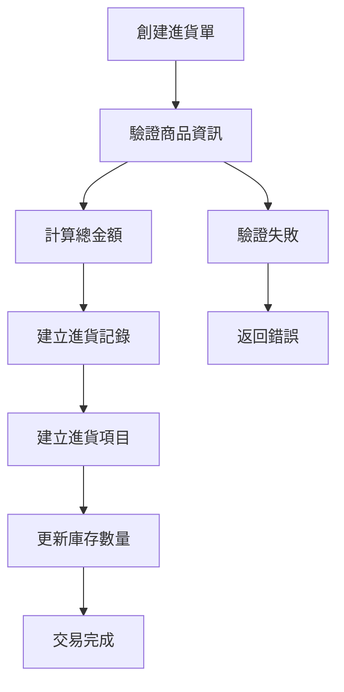
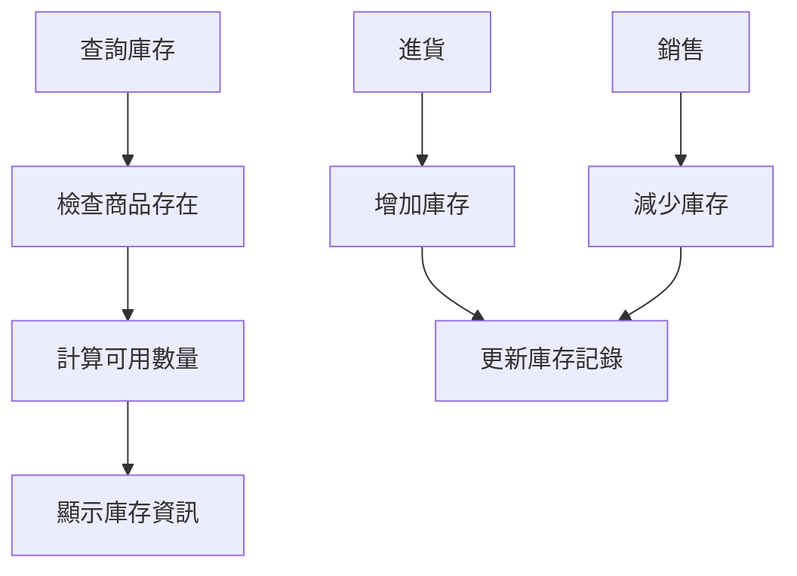
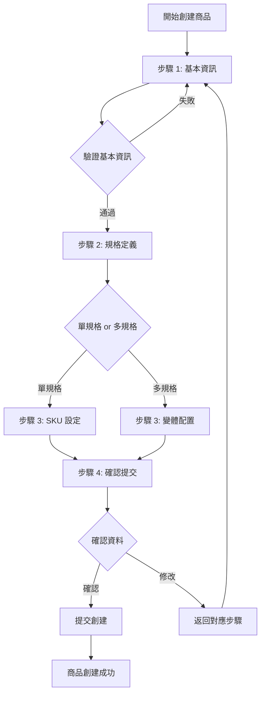

# 庫存管理系統技術架構文檔

## 📋 專案概述

本專案是一個現代化的庫存管理系統，採用前後端分離的架構設計，專為中小企業庫存管理需求而開發。系統包含商品管理、進貨管理、庫存追蹤等核心功能。

## 🏗️ 系統架構

### 整體架構圖

```
┌─────────────────┐    HTTP/REST API    ┌─────────────────┐
│                 │ ◄─────────────────► │                 │
│  前端應用程式    │                     │  後端API服務     │
│  (Next.js 15)   │                     │  (Laravel 12)   │
│                 │                     │                 │
└─────────────────┘                     └─────────────────┘
                                                 │
                                                 ▼
                                        ┌─────────────────┐
                                        │                 │
                                        │  資料庫層        │
                                        │  (MySQL/SQLite) │
                                        │                 │
                                        └─────────────────┘
```

### 技術架構層次

- **展示層 (Presentation Layer)**: Next.js 15 + React 19
- **API層 (API Layer)**: Laravel 12 RESTful API
- **業務邏輯層 (Business Logic Layer)**: Laravel Services + Domain Models
- **資料存取層 (Data Access Layer)**: Eloquent ORM
- **資料庫層 (Database Layer)**: MySQL/SQLite

## 🚀 技術棧詳細資訊

### 前端技術棧 (inventory-client)

#### 核心框架與函式庫
- **Next.js 15.3.3**: React 全端框架，支援 SSR/SSG
- **React 19.0.0**: 使用者介面函式庫
- **TypeScript 5**: 類型安全的 JavaScript 超集

#### UI與樣式
- **Tailwind CSS 4**: 實用優先的 CSS 框架
- **shadcn/ui**: 高品質的 React 元件庫
- **Radix UI**: 無障礙的底層 UI 基礎元件
- **Lucide React**: 現代化圖示庫
- **Tabler Icons**: 補充圖示庫
- **Noto Sans TC**: 思源黑體，支援繁體中文

#### 狀態管理與資料獲取
- **TanStack Query v5**: 伺服器狀態管理與快取
- **openapi-fetch**: 類型安全的 API 客戶端
- **Zod**: 執行時類型驗證
- **React Hooks**: 使用 useReducer 管理複雜表單與嚮導狀態

#### 進階功能
- **@dnd-kit**: 拖放功能實作
- **TanStack Table v8**: 高效能資料表格
- **Recharts**: 資料視覺化圖表
- **next-themes**: 深色/淺色主題切換

#### 開發工具
- **ESLint 9**: 程式碼品質檢查
- **OpenAPI TypeScript**: 自動生成 API 類型定義

### 後端技術棧 (inventory-api)

#### 核心框架
- **Laravel 12.0**: PHP 全端框架
- **PHP 8.2**: 現代 PHP 版本

#### 資料處理與 API
- **Eloquent ORM**: Laravel 的活躍記錄實作
- **Laravel Sanctum 4.0**: API 認證
- **Spatie Laravel Data 4.15**: 資料傳輸物件 (DTO)
- **Spatie Query Builder 6.3**: 動態查詢建構器

#### 文檔與測試
- **Scribe 5.2**: 自動生成 API 文檔
- **PHPUnit 11.5**: 單元測試框架

#### 擴充功能套件
- **Spatie Laravel Permission 6.19**: 角色權限管理
- **Spatie Laravel ActivityLog 4.10**: 活動日誌追蹤
- **Spatie Laravel MediaLibrary 11.13**: 媒體檔案管理

#### 開發工具
- **Laravel Pint**: 程式碼格式化
- **Laravel Sail**: Docker 開發環境

## 🎯 軟體設計原則

### 1. 單一職責原則 (Single Responsibility Principle)

**後端實作範例**:
```php
/**
 * 進貨管理服務類別
 * 專門處理進貨相關的業務邏輯
 */
class PurchaseService
{
    /**
     * 建立新的進貨單
     * 單一職責：僅負責進貨單的建立邏輯
     */
    public function createPurchase(PurchaseData $purchaseData)
    {
        // 業務邏輯實作...
    }
}
```

**前端實作範例**:
```typescript
/**
 * 專門負責產品資料管理的自定義 Hook
 * 單一職責：僅處理產品相關的 API 操作
 */
export function useProducts() {
    return useQuery({
        queryKey: QUERY_KEYS.PRODUCTS,
        queryFn: async () => {
            // API 調用邏輯...
        },
    });
}
```

### 2. 開放封閉原則 (Open-Closed Principle)

- **API 版本控制**: 使用 `/api/v1/` 命名空間，便於擴充新版本
- **元件可擴充性**: 使用 Radix UI 作為基礎，可輕鬆自定義樣式和行為

### 3. 介面隔離原則 (Interface Segregation Principle)

**前端介面分離**:
```typescript
// 專門的查詢鍵定義
export const QUERY_KEYS = {
    PRODUCTS: ['products'] as const,
    PRODUCT: (id: number) => ['products', id] as const,
} as const;
```

### 4. 依賴反轉原則 (Dependency Inversion Principle)

- **後端**: 透過 Laravel 的服務容器進行依賴注入
- **前端**: 使用 React Context 和 Provider 模式管理依賴

## 🏛️ 設計模式實作

### 1. Repository Pattern (儲存庫模式)

**Laravel Eloquent 實作**:
```php
class ProductController extends Controller
{
    /**
     * 使用 Eloquent 作為資料存取層
     * 抽象化資料庫操作邏輯
     */
    public function index()
    {
        return QueryBuilder::for(Product::class)
            ->allowedFilters(['name', 'sku'])
            ->allowedSorts(['name', 'selling_price', 'created_at'])
            ->paginate(15);
    }
}
```

### 2. Data Transfer Object Pattern (資料傳輸物件模式)

**使用 Spatie Laravel Data**:
```php
/**
 * 產品資料傳輸物件
 * 確保資料結構的一致性和類型安全
 */
class ProductData extends Data
{
    public function __construct(
        public int $id,
        public string $name,
        public string $sku,
        public ?string $description,
        public float $selling_price,
        public float $cost_price,
    ) {}
}
```

### 3. Service Layer Pattern (服務層模式)

**業務邏輯封裝**:
```php
/**
 * 進貨服務層
 * 封裝複雜的業務邏輯，確保資料一致性
 */
class PurchaseService
{
    public function createPurchase(PurchaseData $purchaseData)
    {
        return DB::transaction(function () use ($purchaseData) {
            // 複雜的業務邏輯處理
            // 1. 建立進貨單
            // 2. 建立進貨項目
            // 3. 更新庫存
        });
    }
}
```

### 4. Query Object Pattern (查詢物件模式)

**Spatie Query Builder 實作**:
```php
QueryBuilder::for(Product::class)
    ->allowedFilters(['name', 'sku'])
    ->allowedSorts(['name', 'selling_price', 'created_at'])
    ->paginate(15);
```

### 5. Hook Pattern (React Hooks 模式)

**自定義 Hook 封裝**:
```typescript
/**
 * 產品管理相關的 Hook
 * 封裝資料獲取、變更和快取邏輯
 */
export function useCreateProduct() {
    const queryClient = useQueryClient();
    
    return useMutation({
        mutationFn: async (productData) => {
            // API 調用邏輯
        },
        onSuccess: () => {
            // 快取更新邏輯
            queryClient.invalidateQueries({ queryKey: QUERY_KEYS.PRODUCTS });
        },
    });
}
```

### 6. Provider Pattern (提供者模式)

**React Context 實作**:
```typescript
/**
 * 全域狀態提供者
 * 管理主題、查詢客戶端等應用狀態
 */
export default function RootLayout({ children }) {
    return (
        <ThemeProvider>
            <QueryProvider>
                <SidebarProvider>
                    {children}
                </SidebarProvider>
            </QueryProvider>
        </ThemeProvider>
    );
}
```

## 📊 資料庫設計

### 核心資料表結構

```sql
-- 商品表
products
├── id (PK)
├── name
├── sku (唯一)
├── description
├── selling_price
├── cost_price
└── timestamps

-- 店鋪表
stores
├── id (PK)
├── name
├── address
└── timestamps

-- 庫存表
inventories
├── id (PK)
├── store_id (FK)
├── product_id (FK)
├── quantity
└── timestamps

-- 進貨單表
purchases
├── id (PK)
├── store_id (FK)
├── order_number
├── purchased_at
├── total_amount
└── timestamps

-- 進貨項目表
purchase_items
├── id (PK)
├── purchase_id (FK)
├── product_id (FK)
├── quantity
├── unit_price
└── timestamps
```

### 資料關聯設計

- **一對多關聯**: Store ↔ Inventory, Purchase ↔ PurchaseItem
- **多對多關聯**: Store ↔ Product (透過 Inventory)
- **外鍵約束**: 確保資料完整性

## 🔄 業務流程邏輯

### 1. 進貨流程



### 2. 庫存管理流程



### 3. 商品創建嚮導流程



## 🧭 嚮導系統架構

### 狀態管理設計

本系統採用 `useReducer` Hook 管理多步驟表單的複雜狀態，確保狀態管理的一致性和可預測性。

#### 狀態結構設計

```typescript
/**
 * 嚮導表單數據結構
 * 分層管理不同步驟的資料
 */
interface WizardFormData {
  basicInfo: {
    name: string;
    description: string;
    category_id: number | null;
  };
  specs: {
    isVariable: boolean;
    selectedAttrs: Set<number>;
    optionsMap: Record<number, string[]>;
  };
  variants: SKUVariant[];
}

/**
 * 嚮導整體狀態
 */
interface WizardState {
  currentStep: number;
  formData: WizardFormData;
}
```

#### Action 設計原則

遵循 Redux 風格的 Action 設計，確保狀態更新的可追蹤性：

```typescript
type WizardAction =
  | { type: 'NEXT_STEP' }
  | { type: 'PREV_STEP' }
  | { type: 'GO_TO_STEP'; payload: number }
  | { type: 'UPDATE_BASIC_INFO'; payload: Partial<WizardFormData['basicInfo']> }
  | { type: 'UPDATE_SPECS'; payload: Partial<WizardFormData['specs']> }
  | { type: 'UPDATE_VARIANTS'; payload: WizardFormData['variants'] };
```

### 步驟管理策略

1. **步驟驗證**: 每個步驟完成前進行數據驗證
2. **狀態持久化**: 在步驟間保持數據狀態
3. **條件導航**: 根據用戶選擇動態調整步驟流程
4. **錯誤處理**: 提供清晰的錯誤回饋和修正路徑

### 實作特色

- **類型安全**: 完整的 TypeScript 類型定義
- **狀態不可變性**: 使用展開運算符確保狀態不可變
- **開發者友善**: 開發模式下提供狀態調試面板
- **用戶體驗**: 進度指示器和步驟導航
- **模組化設計**: 每個步驟都是獨立的 React 元件
- **實時同步**: 使用 react-hook-form 的 watch 功能實現實時狀態同步

### 步驟元件實作

#### 步驟一：基本資訊 (Step1BasicInfo)

已完成實作，包含以下功能：

```typescript
// 元件位置：src/components/products/wizard-steps/Step1BasicInfo.tsx
interface Step1Props {
  initialData: {
    name: string;
    description: string;
    category_id: number | null;
  };
  onDataChange: (data: Step1Props['initialData']) => void;
}
```

**技術特色**:
- **表單管理**: 使用 react-hook-form 進行專業的表單管理
- **實時同步**: 透過 useEffect + watch 組合實現與父元件狀態的實時同步
- **分類整合**: 整合 CategoryCombobox 元件，支援分類選擇
- **響應式設計**: 使用 shadcn/ui 元件庫，適配各種螢幕尺寸
- **用戶回饋**: 提供即時的表單狀態指示和操作提示

**資料流程**:
1. 父元件 (CreateProductPage) 透過 initialData 將狀態傳入子元件
2. 子元件透過 onDataChange 回調更新父元件的 useReducer 狀態
3. 實現雙向資料綁定和即時狀態同步

#### 步驟二：規格定義 (Step2Specifications)

已完成基礎架構，包含以下功能：

```typescript
// 元件位置：src/components/products/wizard-steps/Step2Specifications.tsx
interface Step2Props {
  initialData: {
    isVariable: boolean;
    selectedAttrs: Set<number>;
    optionsMap: Record<number, string[]>;
  };
  onDataChange: (data: Step2Props['initialData']) => void;
  availableAttributes: Attribute[];
}
```

**已實作功能**:
- ✅ **模式切換**: 單規格/多規格模式切換
- ✅ **狀態管理**: 本地狀態 + 父元件 useReducer 完美整合
- ✅ **屬性選擇介面**: 支援多選屬性，即時狀態更新
- ✅ **規格值動態輸入**: 支援添加/刪除屬性值，重複檢測
- ✅ **SKU 組合生成算法**: 笛卡爾積算法，自動生成所有組合
- ✅ **變體編輯表格**: 可編輯的 SKU 編號和價格設定
- ✅ **用戶體驗**: 完整的載入狀態、錯誤提示、成功回饋
- ✅ **類型安全**: 完整的 TypeScript 支援和 VariantData 介面

**核心技術特色**:
```typescript
// 笛卡爾積算法實現
function cartesianProduct<T>(arrays: T[][]): T[][] {
  return arrays.reduce<T[][]>(
    (a, b) => a.flatMap(x => b.map(y => [...x, y])),
    [[]]
  );
}

// SKU 自動生成
const newVariants: VariantData[] = combinations.map(combo => {
  const key = combo.map(opt => `${opt.attributeId}-${opt.value}`).join('|');
  const defaultSku = combo.map(opt => opt.value.toUpperCase()).join('-');
  return { key, options: combo, sku: defaultSku, price: '0.00' };
});
```

#### 步驟三：預覽與確認 (Step3Review)

全新完成的最終階段元件：

```typescript
// 元件位置：src/components/products/wizard-steps/Step3Review.tsx
interface Step3Props {
  formData: WizardFormData;
  availableAttributes?: Array<{ id: number; name: string }>;
  availableCategories?: Array<{ id: number; name: string }>;
}
```

**已實作功能**:
- ✅ **完整資料預覽**: 分區塊展示所有步驟的輸入資料
- ✅ **智慧顯示邏輯**: 單/多規格商品的差異化呈現
- ✅ **變體資料表格**: 美觀的 SKU 變體列表展示
- ✅ **統計資訊**: 自動計算變體數量和平均價格
- ✅ **視覺化設計**: 使用圖標和色彩提升用戶體驗
- ✅ **最終確認提示**: 明確的操作指導和警告訊息

#### 表單提交系統

完整的端到端提交流程：

```typescript
// 完整的資料驗證與轉換
const handleSubmit = async () => {
  // 1. 資料驗證
  if (!formData.basicInfo.name.trim()) {
    toast.error('請填寫商品名稱');
    dispatch({ type: 'GO_TO_STEP', payload: 1 });
    return;
  }

  // 2. 資料格式轉換
  const submissionData = {
    name: formData.basicInfo.name.trim(),
    description: formData.basicInfo.description?.trim() || null,
    category_id: formData.basicInfo.category_id,
    is_variable: formData.specs.isVariable,
    attributes: Array.from(formData.specs.selectedAttrs),
    variants: formatVariantsForAPI(formData.variants)
  };

  // 3. API 調用與錯誤處理
  await createProductMutation.mutateAsync(submissionData);
  toast.success('商品已成功建立！');
  router.push('/products');
};
```

### 整合狀況

三個步驟元件已完美整合到主頁面 (`CreateProductPage`)，實現：

```typescript
// 統一的資料處理函數
const handleStepDataChange = (step: keyof WizardFormData, data: WizardFormData[keyof WizardFormData]) => {
  const actionType = `UPDATE_${step.toUpperCase()}` as const;
  dispatch({ type: actionType, payload: data } as WizardAction);
};

// 元件使用
<Step1BasicInfo
  initialData={formData.basicInfo}
  onDataChange={(data) => handleStepDataChange('basicInfo', data)}
/>

<Step2Specifications
  initialData={formData.specs}
  onDataChange={(data) => handleStepDataChange('specs', data)}
  onVariantsChange={handleVariantsUpdate}
  availableAttributes={allAttributes}
/>

<Step3Review
  formData={formData}
  availableAttributes={allAttributes}
  availableCategories={allCategories}
/>
```

### 最終系統特色

## 🎯 嚮導系統完成總覽

**系統架構成就**:
- ✅ **3步驟嚮導流程**: 基本資訊 → 規格定義 → 預覽確認
- ✅ **完整狀態管理**: useReducer + 本地狀態的混合架構
- ✅ **類型安全設計**: 100% TypeScript 覆蓋，零 any 類型使用
- ✅ **響應式 UI**: 完整的 shadcn/ui 元件庫整合
- ✅ **錯誤處理**: 完善的驗證、提示、和錯誤恢復機制

**核心技術亮點**:
1. **統一的資料流模式**: 所有步驟都遵循相同的 props 介面和資料流設計
2. **智慧狀態同步**: 即時的雙向資料綁定，確保跨步驟狀態一致性
3. **模組化架構**: 每個步驟都是獨立的功能模組，易於維護和擴展
4. **算法實現**: 笛卡爾積 SKU 生成算法，支援複雜的多規格商品
5. **用戶體驗**: 完整的載入狀態、進度指示、和操作回饋系統

**資料流架構**:Data 傳入初始資料
2. Step1BasicInfo 使用 react-hook-form 管理內部表單狀態
3. 任何表單變更透過 watch 監聽並調用 onDataChange
4. onDataChange 觸發父元件的 useReducer dispatch
5. 狀態更新後重新渲染，形成完整的資料流閉環

## 🔐 安全性設計

### API 安全
- **Laravel Sanctum**: API 權杖認證
- **CORS 設定**: 跨域請求控制
- **輸入驗證**: Request 類別驗證
- **SQL 注入防護**: Eloquent ORM 參數化查詢

### 前端安全
- **類型安全**: TypeScript 編譯時檢查
- **輸入驗證**: Zod 執行時驗證
- **XSS 防護**: React 自動跳脫
- **HTTPS**: 生產環境強制使用

## 📈 效能最佳化

### 後端效能
- **資料庫索引**: 主鍵、外鍵、查詢欄位
- **Eloquent 最佳化**: 使用 `select()` 限制欄位
- **查詢快取**: Laravel 查詢結果快取
- **分頁處理**: 避免大量資料載入

### 前端效能
- **React Query 快取**: 伺服器狀態智慧快取
- **懶加載**: 動態導入非關鍵元件
- **圖片最佳化**: Next.js Image 元件
- **程式碼分割**: 自動程式碼分割
- **Tree Shaking**: 移除未使用的程式碼

## 🧪 測試策略

### 後端測試
- **單元測試**: PHPUnit 測試個別方法
- **功能測試**: 測試 API 端點
- **整合測試**: 測試服務間互動

### 前端測試
- **元件測試**: 測試 React 元件行為
- **Hook 測試**: 測試自定義 Hook
- **E2E 測試**: 端到端使用者流程測試

## 📱 響應式設計

### 行動優先設計
- **Tailwind CSS**: 行動優先的斷點系統
- **useIsMobile Hook**: 裝置檢測
- **Drawer 元件**: 行動裝置適配的對話框
- **Touch 友善**: 觸控操作最佳化

### 跨瀏覽器支援
- **現代瀏覽器**: Chrome、Firefox、Safari、Edge
- **向後相容**: 透過 Babel 和 Polyfill
- **漸進式增強**: 基礎功能優先

## 🚀 部署與維運

### 開發環境
- **Next.js Dev Server**: 熱重載開發伺服器
- **API 文檔**: Scribe 自動生成文檔

### 生產環境建議
- **容器化部署**: Docker + Docker Compose
- **反向代理**: Nginx
- **資料庫**: MySQL 8.0+
- **檔案儲存**: S3 相容儲存
- **監控**: Laravel Telescope + APM 工具

## 📚 程式碼品質

### 程式碼規範
- **PHP**: PSR-12 編碼標準
- **JavaScript/TypeScript**: ESLint + Prettier
- **CSS**: Tailwind CSS 類別排序

### 文檔註解
- **PHP DocBlock**: 完整的方法和類別文檔
- **TypeScript JSDoc**: 函式和介面說明
- **README**: 專案設定和使用說明

### 版本控制
- **Git Flow**: 功能分支開發流程
- **語意化版本**: SemVer 版本標記
- **Conventional Commits**: 標準化提交訊息

## 🔮 未來擴充規劃

### 功能擴充
- **多語言支援**: i18n 國際化
- **即時通知**: WebSocket 推送
- **進階報表**: 更豐富的資料分析
- **行動應用**: React Native 跨平台應用

### 技術升級
- **微服務架構**: 服務拆分和獨立部署
- **GraphQL**: 更靈活的 API 查詢
- **Redis**: 高效能快取和會話儲存
- **Elasticsearch**: 全文搜尋功能