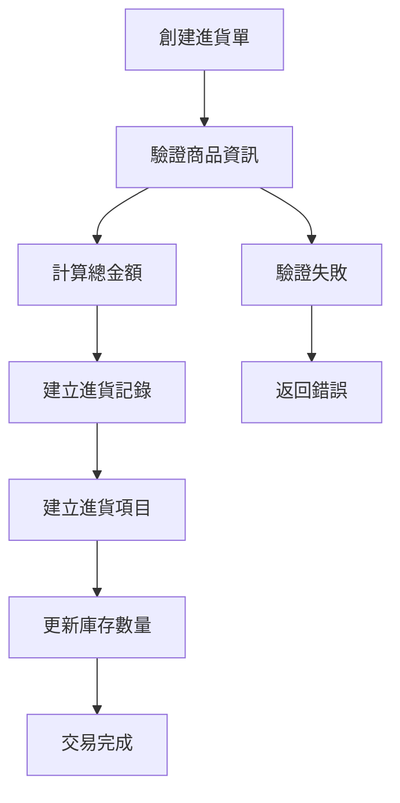
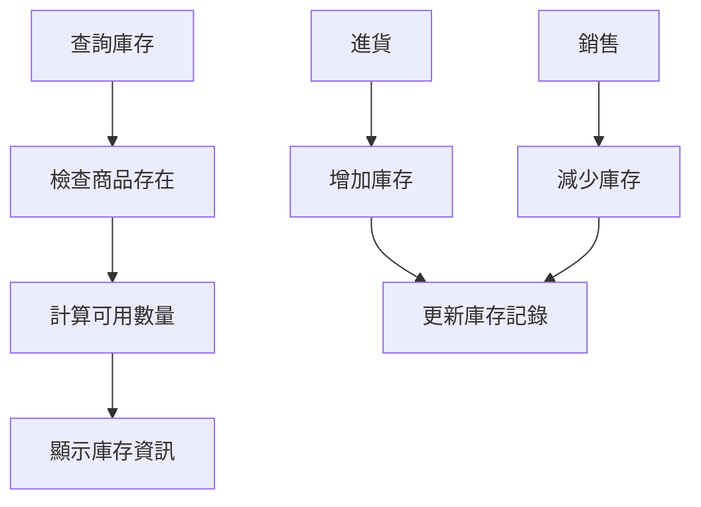

# 庫存管理系統技術架構文檔

## 🔥 最新更新

### 2025-01-12 商品庫存狀態分類功能
- **問題**：商品清單的庫存狀態只簡單顯示「有庫存」或「無庫存」，無法反映部分變體有庫存的情況
- **解決方案**：
  1. 實現3種庫存狀態分類：
     - **有庫存**：所有變體都有庫存（包括單一規格商品）
     - **部分庫存**：部分變體有庫存
     - **無庫存**：所有變體都沒有庫存
  2. 使用不同的 Badge 顏色和圖標來區分狀態：
     - 有庫存：綠色 secondary Badge + CheckCircle 圖標
     - 部分庫存：灰色 outline Badge + Package 圖標
     - 無庫存：紅色 destructive Badge + Box 圖標
  3. 精確計算每個變體的庫存總量，提供更準確的庫存狀態判斷
- **影響範圍**：
  - `inventory-client/src/components/products/columns.tsx` - 狀態欄位邏輯重構

### 2025-01-12 訂單付款功能增強
- **問題**：部分付款功能太邊緣化，只能通過 Modal 記錄但看不到歷史
- **解決方案**：
  1. 在訂單詳情頁新增付款進度卡片，顯示已付/未付金額和視覺化進度條
  2. 新增付款歷史卡片，展示所有付款記錄（金額、方式、日期、操作人員）
  3. 擴展 ProcessedOrder 類型定義以支援 payment_records
  4. 增強快取同步機制，確保付款後無需手動刷新頁面
- **影響範圍**：
  - `OrderDetailComponent.tsx` - UI 改進
  - `api-helpers.ts` - 類型定義擴展
  - `useEntityQueries.ts` - 快取同步優化

---

## 📋 專案概述

本專案是一個現代化的庫存管理系統，採用前後端分離的架構設計，專為中小企業庫存管理需求而開發。系統包含商品管理、進貨管理、庫存追蹤等核心功能。

## 🏗️ 系統架構

### 整體架構圖

```
┌─────────────────┐    HTTP/REST API    ┌─────────────────┐
│                 │ ◄─────────────────► │                 │
│  前端應用程式    │                     │  後端API服務     │
│  (Next.js 15)   │                     │  (Laravel 12)   │
│                 │                     │                 │
└─────────────────┘                     └─────────────────┘
                                                 │
                                                 ▼
                                        ┌─────────────────┐
                                        │                 │
                                        │  資料庫層        │
                                        │  (MySQL/SQLite) │
                                        │                 │
                                        └─────────────────┘
```

### 技術架構層次

- **展示層 (Presentation Layer)**: Next.js 15 + React 19
- **API層 (API Layer)**: Laravel 12 RESTful API
- **業務邏輯層 (Business Logic Layer)**: Laravel Services + Domain Models
- **資料存取層 (Data Access Layer)**: Eloquent ORM
- **資料庫層 (Database Layer)**: MySQL/SQLite

## 🚀 技術棧詳細資訊

### 前端技術棧 (inventory-client)

#### 核心框架與函式庫
- **Next.js 15.3.3**: React 全端框架，支援 SSR/SSG
- **React 19.0.0**: 使用者介面函式庫
- **TypeScript 5**: 類型安全的 JavaScript 超集

#### UI與樣式
- **Tailwind CSS 4**: 實用優先的 CSS 框架
- **shadcn/ui**: 高品質的 React 元件庫
- **Radix UI**: 無障礙的底層 UI 基礎元件
- **Lucide React**: 現代化圖示庫
- **Tabler Icons**: 補充圖示庫
- **Noto Sans TC**: 思源黑體，支援繁體中文

#### 狀態管理與資料獲取
- **TanStack Query v5**: 伺服器狀態管理與快取
- **openapi-fetch**: 類型安全的 API 客戶端
- **Zod**: 執行時類型驗證

#### 進階功能
- **@dnd-kit**: 拖放功能實作
- **TanStack Table v8**: 高效能資料表格
- **Recharts**: 資料視覺化圖表
- **next-themes**: 深色/淺色主題切換

#### 開發工具
- **ESLint 9**: 程式碼品質檢查
- **OpenAPI TypeScript**: 自動生成 API 類型定義

### 後端技術棧 (inventory-api)

#### 核心框架
- **Laravel 12.0**: PHP 全端框架
- **PHP 8.2**: 現代 PHP 版本

#### 資料處理與 API
- **Eloquent ORM**: Laravel 的活躍記錄實作
- **Laravel Sanctum 4.0**: API 認證
- **Spatie Laravel Data 4.15**: 資料傳輸物件 (DTO)
- **Spatie Query Builder 6.3**: 動態查詢建構器

#### 文檔與測試
- **Scribe 5.2**: 自動生成 API 文檔
- **PHPUnit 11.5**: 單元測試框架

#### 擴充功能套件
- **Spatie Laravel Permission 6.19**: 角色權限管理
- **Spatie Laravel ActivityLog 4.10**: 活動日誌追蹤
- **Spatie Laravel MediaLibrary 11.13**: 媒體檔案管理

#### 開發工具
- **Laravel Pint**: 程式碼格式化
- **Laravel Sail**: Docker 開發環境

## 🎯 軟體設計原則

### 1. 單一職責原則 (Single Responsibility Principle)

**後端實作範例**:
```php
/**
 * 進貨管理服務類別
 * 專門處理進貨相關的業務邏輯
 */
class PurchaseService
{
    /**
     * 建立新的進貨單
     * 單一職責：僅負責進貨單的建立邏輯
     */
    public function createPurchase(PurchaseData $purchaseData)
    {
        // 業務邏輯實作...
    }
}
```

**前端實作範例**:
```typescript
/**
 * 專門負責產品資料管理的自定義 Hook
 * 單一職責：僅處理產品相關的 API 操作
 */
export function useProducts() {
    return useQuery({
        queryKey: QUERY_KEYS.PRODUCTS,
        queryFn: async () => {
            // API 調用邏輯...
        },
    });
}
```

### 2. 開放封閉原則 (Open-Closed Principle)

- **API 版本控制**: 使用 `/api/` 命名空間，便於擴充新版本
- **元件可擴充性**: 使用 Radix UI 作為基礎，可輕鬆自定義樣式和行為

### 3. 介面隔離原則 (Interface Segregation Principle)

**前端介面分離**:
```typescript
// 專門的查詢鍵定義
export const QUERY_KEYS = {
    PRODUCTS: ['products'] as const,
    PRODUCT: (id: number) => ['products', id] as const,
} as const;
```

### 4. 依賴反轉原則 (Dependency Inversion Principle)

- **後端**: 透過 Laravel 的服務容器進行依賴注入
- **前端**: 使用 React Context 和 Provider 模式管理依賴

## 🏛️ 設計模式實作

### 1. Repository Pattern (儲存庫模式)

**Laravel Eloquent 實作**:
```php
class ProductController extends Controller
{
    /**
     * 使用 Eloquent 作為資料存取層
     * 抽象化資料庫操作邏輯
     */
    public function index()
    {
        return QueryBuilder::for(Product::class)
            ->allowedFilters(['name', 'sku'])
            ->allowedSorts(['name', 'selling_price', 'created_at'])
            ->paginate(15);
    }
}
```

### 2. Data Transfer Object Pattern (資料傳輸物件模式)

**使用 Spatie Laravel Data**:
```php
/**
 * 產品資料傳輸物件
 * 確保資料結構的一致性和類型安全
 */
class ProductData extends Data
{
    public function __construct(
        public int $id,
        public string $name,
        public string $sku,
        public ?string $description,
        public float $selling_price,
        public float $cost_price,
    ) {}
}
```

### 3. Service Layer Pattern (服務層模式)

**業務邏輯封裝**:
```php
/**
 * 進貨服務層
 * 封裝複雜的業務邏輯，確保資料一致性
 */
class PurchaseService
{
    public function createPurchase(PurchaseData $purchaseData)
    {
        return DB::transaction(function () use ($purchaseData) {
            // 複雜的業務邏輯處理
            // 1. 建立進貨單
            // 2. 建立進貨項目
            // 3. 更新庫存
        });
    }
}
```

### 4. Query Object Pattern (查詢物件模式)

**Spatie Query Builder 實作**:
```php
QueryBuilder::for(Product::class)
    ->allowedFilters(['name', 'sku'])
    ->allowedSorts(['name', 'selling_price', 'created_at'])
    ->paginate(15);
```

### 5. Hook Pattern (React Hooks 模式)

**自定義 Hook 封裝**:
```typescript
/**
 * 產品管理相關的 Hook
 * 封裝資料獲取、變更和快取邏輯
 */
export function useCreateProduct() {
    const queryClient = useQueryClient();
    
    return useMutation({
        mutationFn: async (productData) => {
            // API 調用邏輯
        },
        onSuccess: () => {
            // 快取更新邏輯
            queryClient.invalidateQueries({ queryKey: QUERY_KEYS.PRODUCTS });
        },
    });
}
```

### 6. Provider Pattern (提供者模式)

**React Context 實作**:
```typescript
/**
 * 全域狀態提供者
 * 管理主題、查詢客戶端等應用狀態
 */
export default function RootLayout({ children }) {
    return (
        <ThemeProvider>
            <QueryProvider>
                <SidebarProvider>
                    {children}
                </SidebarProvider>
            </QueryProvider>
        </ThemeProvider>
    );
}
```

## 📊 資料庫設計

### 核心資料表結構

```sql
-- 商品表
products
├── id (PK)
├── name
├── sku (唯一)
├── description
├── selling_price
├── cost_price
└── timestamps

-- 店鋪表
stores
├── id (PK)
├── name
├── address
└── timestamps

-- 庫存表
inventories
├── id (PK)
├── store_id (FK)
├── product_id (FK)
├── quantity
└── timestamps

-- 進貨單表
purchases
├── id (PK)
├── store_id (FK)
├── order_number
├── purchased_at
├── total_amount
└── timestamps

-- 進貨項目表
purchase_items
├── id (PK)
├── purchase_id (FK)
├── product_id (FK)
├── quantity
├── unit_price
└── timestamps
```

### 資料關聯設計

- **一對多關聯**: Store ↔ Inventory, Purchase ↔ PurchaseItem
- **多對多關聯**: Store ↔ Product (透過 Inventory)
- **外鍵約束**: 確保資料完整性

## 🔄 業務流程邏輯

### 1. 進貨流程



### 2. 庫存管理流程



## 🔐 安全性設計

### API 安全
- **Laravel Sanctum**: API 權杖認證
- **CORS 設定**: 跨域請求控制
- **輸入驗證**: Request 類別驗證
- **SQL 注入防護**: Eloquent ORM 參數化查詢

### 前端安全
- **類型安全**: TypeScript 編譯時檢查
- **輸入驗證**: Zod 執行時驗證
- **XSS 防護**: React 自動跳脫
- **HTTPS**: 生產環境強制使用

## 📈 效能最佳化

### 後端效能
- **資料庫索引**: 主鍵、外鍵、查詢欄位
- **Eloquent 最佳化**: 使用 `select()` 限制欄位
- **查詢快取**: Laravel 查詢結果快取
- **分頁處理**: 避免大量資料載入

### 前端效能
- **React Query 快取**: 伺服器狀態智慧快取
- **懶加載**: 動態導入非關鍵元件
- **圖片最佳化**: Next.js Image 元件
- **程式碼分割**: 自動程式碼分割
- **Tree Shaking**: 移除未使用的程式碼

## 🧪 測試策略

### 後端測試
- **單元測試**: PHPUnit 測試個別方法
- **功能測試**: 測試 API 端點
- **整合測試**: 測試服務間互動

### 前端測試
- **元件測試**: 測試 React 元件行為
- **Hook 測試**: 測試自定義 Hook
- **E2E 測試**: 端到端使用者流程測試

## 📱 響應式設計

### 行動優先設計
- **Tailwind CSS**: 行動優先的斷點系統
- **useIsMobile Hook**: 裝置檢測
- **Drawer 元件**: 行動裝置適配的對話框
- **Touch 友善**: 觸控操作最佳化

### 跨瀏覽器支援
- **現代瀏覽器**: Chrome、Firefox、Safari、Edge
- **向後相容**: 透過 Babel 和 Polyfill
- **漸進式增強**: 基礎功能優先

## 🚀 部署與維運

### 開發環境
- **Next.js Dev Server**: 熱重載開發伺服器
- **API 文檔**: Scribe 自動生成文檔

### 生產環境建議
- **容器化部署**: Docker + Docker Compose
- **反向代理**: Nginx
- **資料庫**: MySQL 8.0+
- **檔案儲存**: S3 相容儲存
- **監控**: Laravel Telescope + APM 工具

## 📚 程式碼品質

### 程式碼規範
- **PHP**: PSR-12 編碼標準
- **JavaScript/TypeScript**: ESLint + Prettier
- **CSS**: Tailwind CSS 類別排序

### 文檔註解
- **PHP DocBlock**: 完整的方法和類別文檔
- **TypeScript JSDoc**: 函式和介面說明
- **README**: 專案設定和使用說明

### 版本控制
- **Git Flow**: 功能分支開發流程
- **語意化版本**: SemVer 版本標記
- **Conventional Commits**: 標準化提交訊息

## 🔮 未來擴充規劃

### 功能擴充
- **多語言支援**: i18n 國際化
- **即時通知**: WebSocket 推送
- **進階報表**: 更豐富的資料分析
- **行動應用**: React Native 跨平台應用

### 技術升級
- **微服務架構**: 服務拆分和獨立部署
- **GraphQL**: 更靈活的 API 查詢
- **Redis**: 高效能快取和會話儲存
- **Elasticsearch**: 全文搜尋功能

## 🔧 開發流程與工具

### API 文檔生成流程

為了確保前後端 API 契約的一致性，我們建立了標準化的文檔生成流程：

#### 自動化腳本（推薦）
```bash
# 執行一鍵生成腳本
cd inventory-api
./regenerate-api-docs.sh
```

#### 手動步驟
```bash
# 1. 生成 Scribe API 文檔
./vendor/bin/sail artisan scribe:generate

# 2. 複製到前端專案
cp storage/app/private/scribe/openapi.yaml ../inventory-client/openapi.yaml

# 3. 生成 TypeScript 類型定義
cd ../inventory-client && npm run api:types
```

### 開發注意事項

1. **契約優先開發**: 修改 API 時先更新 PHPDoc 註釋
2. **日期類型規範**: 
   - 根據 Scribe 官方文檔，`@bodyParam` 和 `@queryParam` 只支援 `string`、`integer`、`number`、`boolean`、`object` 和 `file` 類型
   - **建議統一使用 `string` 類型表示日期**，並在描述中說明格式
   - 日期格式：`string` 類型，說明 `格式：Y-m-d`
   - 日期時間格式：`string` 類型，說明 `格式：Y-m-d H:i:s`
3. **版本控制**: 生成的 `openapi.yaml` 和 `api.ts` 應該納入版本控制
4. **測試驗證**: 更新 API 後執行 `npm run build` 確認無類型錯誤

## API 契約同步

### 工作流程

1. **後端變更**
   - 修改 Controller 的 PHPDoc 註解
   - 更新對應的 Form Request 類別

2. **生成 API 文檔**
   ```bash
   cd inventory-api
   ./regenerate-api-docs.sh
   ```

3. **前端使用**
   - TypeScript 類型會自動更新到 `src/types/api.ts`
   - 使用 apiClient 進行類型安全的 API 調用

### 重要技術決策

#### 類型標準化 (2025-01-20)

經過技術評估，我們決定將所有日期相關的 API 參數標準化為 `string` 類型：

1. **背景**
   - 團隊早期使用了 Scribe 不支持的類型（`date`、`datetime`、`numeric`）
   - 這些非標準類型導致 openapi-typescript 生成錯誤的 TypeScript 類型

2. **技術分析**
   - Scribe 官方只支持：`string`、`integer`、`number`、`boolean`、`object`、`file`
   - 使用非標準類型不會報錯，但會直接傳遞到 OpenAPI 文檔中
   - openapi-typescript 無法識別這些類型，生成 `Record<string, never>`

3. **決策內容**
   - 所有日期類型統一使用 `string`，並在描述中註明格式
   - 例如：`@queryParam start_date string 起始日期 (格式: Y-m-d). Example: 2025-01-01`
   - `numeric` 類型改為標準的 `number`

4. **已完成的遷移**
   - CustomerController: `date` → `string`
   - ReportController: `date` → `string`  
   - InventoryTransferController: `date` → `string`
   - InventoryManagementController: `date` → `string`
   - OrderController: `date`/`datetime` → `string`, `numeric` → `number`
   - InstallationController: 已使用標準 `string` 類型

5. **遷移後的效果**
   - 所有 TypeScript 類型正確生成
   - 不再需要 fix-openapi-types.php 腳本（新代碼）
   - 前端編譯無錯誤